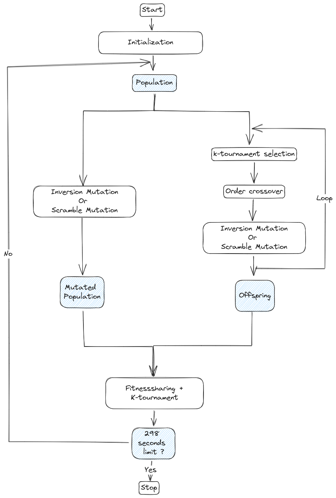

# Finder
*A genetic algorithm to solve the traveling sailesman problem from problem sizes ranging from 50 to 1000 cities.*
## Project Description
This project inplements a [genetic algorithm]() used to solve the [traveling sailesmen problem](). 

## Algorithm Overview
The folling picture gives a high level overview of the algorithm.

