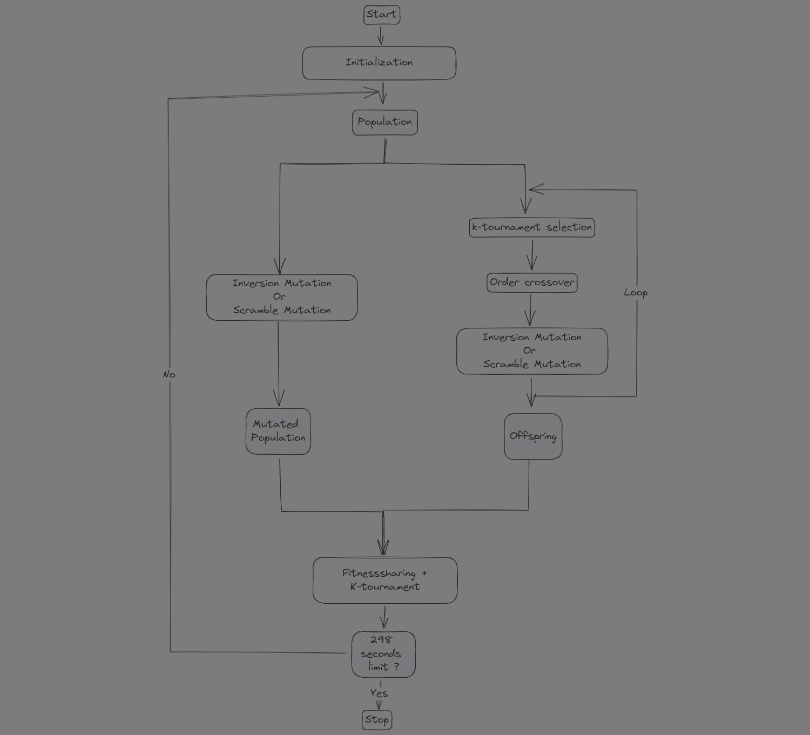

# Finder
*A genetic algorithm to solve the traveling sailesman problem from problem sizes ranging from 50 to 1000 cities.*
## Project Description
This project inplements a [genetic algorithm](https://en.wikipedia.org/wiki/Genetic_algorithm) used to solve the [traveling sailesmen problem](https://en.wikipedia.org/wiki/Travelling_salesman_problem). It is inplemented in [Python](https://github.com/python/cpython) and leverages [Numpy](https://github.com/numpy/numpy) and [Numba](https://github.com/numba/numba) to greatly speed up Python's the execution time. 

_Advantages of Genetic Algorithms_
- Versatility: Genetic algorithms are incredibly versatile, capable of addressing various optimization problems without strict constraints on representation forms or objective functions. This flexibility extends their applicability across diverse domains, including continuous, discrete, and combinatorial optimization.

- Robustness: The inherent ability of genetic algorithms to handle noise and stochasticity within datasets and optimization problems renders them robust. Whether faced with complex solution spaces or noisy data, genetic algorithms maintain efficacy, offering a reliable optimization approach.

- Diverse Population: Unlike many optimization techniques prone to getting stuck in local optima, genetic algorithms maintain a diverse population of potential solutions. This diversity aids in exploration, mitigating the risk of premature convergence and facilitating the discovery of globally optimal solutions.

_Disadvantages of Genetic Algorithms_
- Global Optima Search: While powerful, genetic algorithms do not guarantee finding the globally optimal solution. They serve as effective approximators but may not replace exact solvers in all scenarios.

- Hyperparameter Sensitivity: Fine-tuning genetic algorithms demands careful optimization of hyperparameters, which can be time-consuming. The stochastic nature of the algorithm necessitates multiple runs for reliable results, leading to significant computational overhead.

- Result Reproducibility: Stochastic operators inherent in genetic algorithms pose challenges for result reproducibility. Variability in outcomes makes it challenging to precisely replicate results across different runs.

- Sensitivity to Initialization and Selection: The performance of genetic algorithms can heavily depend on the initial population and selection methods employed. Poor choices in these aspects may lead to suboptimal solutions or prolonged convergence times.

## Algorithm Overview
When designing a genetic algorithm the two opposing concepts of `Exploration` vs `Exploitation` need to be kept in mind. In terms of evolutionairy algorithms, this mens strinking a balance between `population diversity` promoting mechanisms and `population exploitation`mechanisms. Enough diversity needs to be introduced to explore enough of the solution space and escapce local minima, but to much randomness and the algorithm might never find the global optimum. 

In what follows the most important operdators and design choices of the algorithm are outlined. 

### Representation
The candidates are represented as a permutation of cities, where the cities are numbered from zero to the number of cities-1. The order of the list thus determines the order of the cycle, e.g. [0,1,2] means that city 1 will be visited right after city 0, city 2 right after city 1, and city 0 right after city 2. This representation is short and directly represents the ordering of the cities, but it does allow for multiple different representations to represent the same cycle. The generated permutations (population) are stored in NumPy matrix, where each row corresponds to an individual solution (permutation of cities) or candidate solution. The fitness values corresponding to these permutations are stores in a separate Numpy array
### Initialization
A balance of 20%, 80% was used between greedily and valid permutations. Greedy permutations helped the algorithm to find good areas in the search space, but could misslead the algorithms in converging to local optima quickly. Therefor the majority of permutations where initialized validly. It should be noted that, both the legal and valid initalizations make a best effort to find a permutation. If no solution can be found within 10 iterations a random permutation is returned.
### Selection Operator
K-tournament selection is a cheap operator.
K-tournament selection also made it easier to tune `the selective pressure`, something deemed necessary as the algorithm struggled with premature convergence early on.
### Mutation Operator

### Recombination Operator
### Elimination Operator
### Diversitiy Promotion
### Elitism
### Architecture
The folling picture gives a high level overview of the algorithm.

